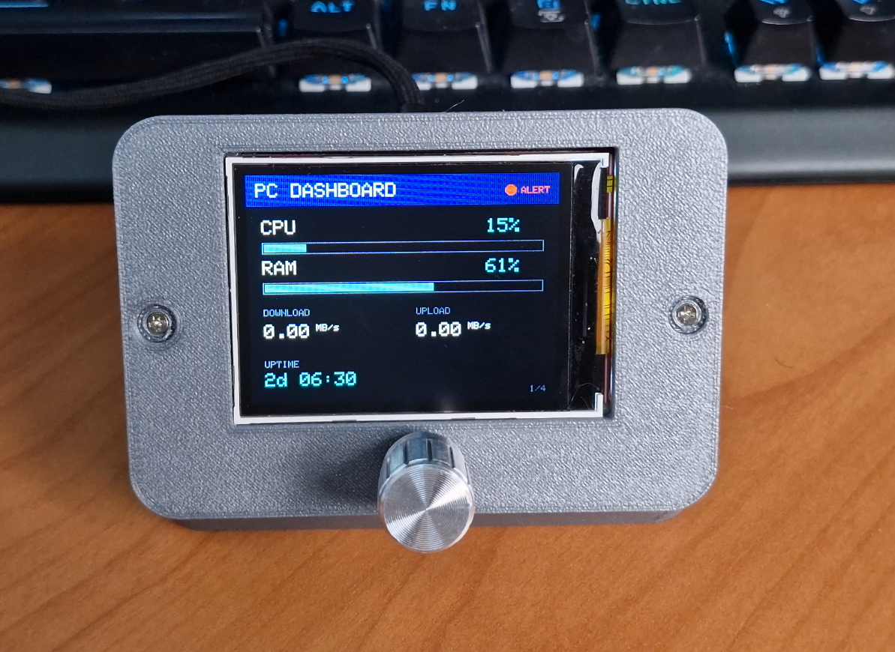
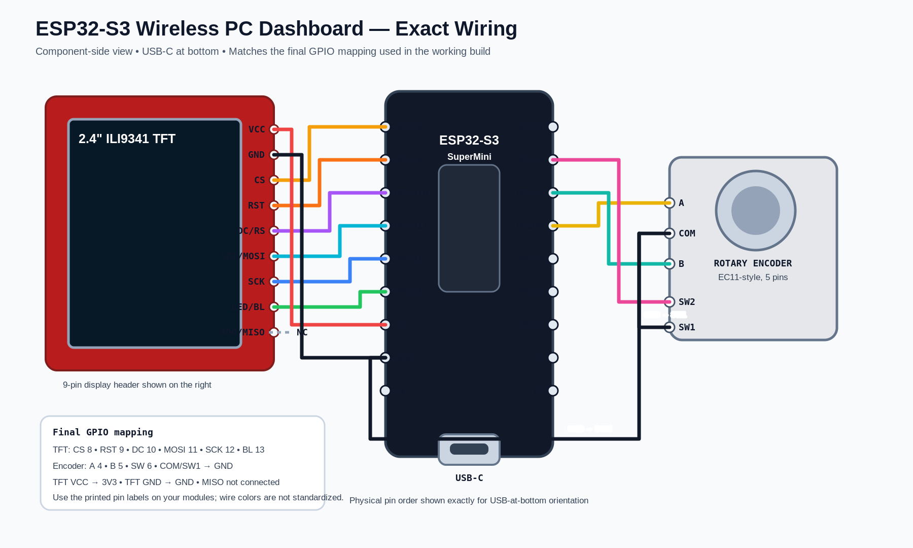

# ESP32-S3 Wireless PC Dashboard + Control

A compact ESP32-S3 desktop dashboard that receives live Windows PC statistics over local Wi-Fi, displays them on a 2.4-inch ILI9341 TFT, and sends PC-control commands back from a rotary encoder.



## What it does

- Live CPU and RAM usage
- Download / upload speed
- PC uptime
- CPU frequency and process count
- Disk read / write activity
- Live CPU history graph
- Network latency and ESP32 Wi-Fi RSSI
- Total RX / TX data
- Top CPU process and top RAM process
- System-health status for CPU, memory, disk and internet
- `OFFLINE` state when PC telemetry stops
- Automatic recovery when the sender or ESP32 restarts
- Rotary encoder navigation across four pages
- Long-press **PC Control Mode**
  - Volume up / down
  - Play / pause
  - Mute
  - Lock Windows
  - Screenshot to clipboard

## Architecture

```text
Windows PC ──UDP telemetry over local Wi-Fi──> ESP32-S3 ──> ILI9341 TFT
Windows PC <──────UDP control commands──────── ESP32-S3 <── Rotary encoder
```

No cloud service is required. The project runs on the local network.

## Hardware

- ESP32-S3 SuperMini / compatible ESP32-S3 board with the same exposed pins
- 2.4-inch ILI9341 SPI TFT (240×320)
- EC11-style rotary encoder with push button
- Breadboard for prototyping or stripboard/perfboard for the final build
- USB-C cable / 5 V USB power
- Optional 3D-printed enclosure

## Exact wiring

**Important:** The diagram is drawn from the component side with the **USB-C connector at the bottom**, matching the final physical build.



Full pin table: [docs/WIRING.md](docs/WIRING.md)

Board orientation reference: [docs/board_pin_order.png](docs/board_pin_order.png)

### TFT

| ILI9341 | ESP32-S3 |
|---|---:|
| VCC | 3V3 |
| GND | GND |
| CS | GPIO8 |
| RST / RESET | GPIO9 |
| DC / RS | GPIO10 |
| SDI / MOSI | GPIO11 |
| SCK / CLK | GPIO12 |
| LED / BL | GPIO13 |
| SDO / MISO | Not connected |

### Rotary encoder

| Encoder | ESP32-S3 |
|---|---:|
| A | GPIO4 |
| COM | GND |
| B | GPIO5 |
| SW1 | GND |
| SW2 | GPIO6 |

## Arduino setup

1. Install the ESP32 board package in Arduino IDE.
2. Select an ESP32-S3 board profile suitable for your SuperMini. If your package does not list the SuperMini specifically, `ESP32S3 Dev Module` is commonly used.
3. Install these libraries using Library Manager:
   - `Adafruit GFX Library`
   - `Adafruit ILI9341`
4. Open:

   `firmware/PC_Dashboard_ESP32_S3.ino`

5. Set your Wi-Fi credentials near the top:

```cpp
const char* WIFI_SSID     = "YOUR_WIFI_SSID";
const char* WIFI_PASSWORD = "YOUR_WIFI_PASSWORD";
```

6. Upload the firmware.
7. After connecting, the TFT briefly shows the ESP32's local IP address. Note that address.

## Windows sender setup

Python 3 is required. The PC-control functions use Windows APIs, so the sender is intended for Windows 10/11.

```powershell
cd pc
py -m pip install -r requirements.txt
```

Open `pc_dashboard_sender_control_v3.py` and set:

```python
ESP32_IP = "YOUR_ESP32_IP"
```

Use the address shown on the ESP32 display, then run:

```powershell
py pc_dashboard_sender_control_v3.py
```

If Windows Firewall asks for access, allow Python on your **private/local network**.

Stop the sender with:

```text
Ctrl + C
```

About six seconds after telemetry stops, the dashboard changes to `OFFLINE`. Restarting the sender restores the dashboard automatically after fresh data arrives.

## Controls

### Dashboard mode

- Rotate encoder: switch pages
- Short press: return to Overview
- Long press (~1.2 s): enter PC Control Mode

### PC Control Mode

- Rotate: select command
- Short press: execute selected command
- Long press: exit control mode

## Project structure

```text
ESP32-Wireless-PC-Dashboard/
├── firmware/
│   └── PC_Dashboard_ESP32_S3.ino
├── pc/
│   ├── pc_dashboard_sender_control_v3.py
│   └── requirements.txt
├── docs/
│   ├── WIRING.md
│   ├── wiring_diagram.svg
│   ├── wiring_diagram.png
│   └── final_build.png
├── .gitignore
├── GITHUB_UPLOAD_GUIDE.md
└── README.md
```

## Notes

- Telemetry is sent over UDP every 0.5 seconds.
- The firmware's final offline timeout is 6000 ms.
- `WiFi.RSSI()` on the ESP32 provides the Wi-Fi signal value shown on the Network page.
- The Python sender measures internet reachability/latency with a TCP connection to `1.1.1.1:443`.
- Screenshot uses the Windows Print Screen key and places the screenshot in the clipboard.
- The firmware learns the PC UDP endpoint from incoming telemetry, then sends control commands back to that endpoint.

## Security

This project is designed for a trusted local network. It does not include authentication or encryption for UDP packets. Do not expose UDP port `4210` directly to the public internet.

## Built by InnoCircuitsLab

If you build or modify it, feel free to share what you changed.
